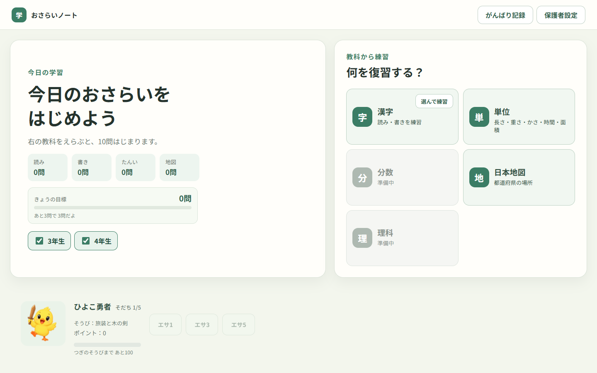

# おさらいノート

小学3〜4年生向け復習アプリの技術検証プロジェクトです。

現段階では、漢字・単位・日本地図の復習と、50音表を使った読み問題を検証できます。漢字の書き問題は、Hanzi WriterでKanjiVG由来の日本語ストロークデータを判定します。

読みの回答と書き問題の完了結果はブラウザ標準のIndexedDBへ保存します。学習データはサーバーへ送信せず、生の筆跡や筆圧は保存しません。

## まず使ってみる

[公開版を開く](https://minoru365.github.io/osarai-note/)



Chromeで公開版を開き、ホーム画面から学年と教科を選ぶと10問の練習を始められます。現在は横向きのタブレット画面を主な対象にしています。

## ドキュメント

- AI開発ツールの入口：Codex等は [AGENTS.md](./AGENTS.md)、Claude Codeは [CLAUDE.md](./CLAUDE.md)、GitHub Copilotは [.github/copilot-instructions.md](./.github/copilot-instructions.md)
- [開発計画](./docs/study-support-plan.md)：今後の仕様、制約、ロードマップ
- [進捗](./docs/progress.md)：現在地、完了、次の作業、検証結果
- [引き継ぎ](./docs/handoff.md)：別セッション・別担当向けの現在地、再開手順、注意事項
- [ADR](./docs/adr/)：重要な設計判断と採用理由
- [IndexedDB v2設計](./docs/db-v2-design.md)：移行、状態遷移、原子的保存の受け入れ条件
- [問題生成の実装境界](./docs/content-generation-design.md)：素材状態、公開条件、機械ゲート
- [自由練習の保存境界](./docs/free-practice-design.md)：未履修除外、回答保存、当日セットとの分離
- [漢字問題の基準資料](./docs/kanji-data-sources.md)：学年配当と常用漢字音訓の出典・版
- [第三者の権利表示](./THIRD-PARTY-NOTICES.md)：利用ライブラリ、データ、ライセンス、出典

## 単元別の進捗

| 単元 | 現在の状態 | 詳細 |
|---|---|---|
| 漢字 | 3・4年生の読み・書き問題を公開中 | [進捗](./docs/progress.md)／[問題生成の実装境界](./docs/content-generation-design.md) |
| 単位 | 換算・大小比較などの問題を公開中 | [単位の計画](./docs/units-plan.md)／[進捗](./docs/progress.md) |
| 日本地図 | 47都道府県の位置当て初版を公開中 | [進捗](./docs/progress.md) |
| モチベーション | ポイント、ペット、がんばり記録を実装済み | [進捗](./docs/progress.md)／[開発計画](./docs/study-support-plan.md) |

未実装の単元や確認待ちの項目は、変動する件数とあわせて [進捗](./docs/progress.md) を参照してください。

## 起動

```powershell
npm ci
npm run dev
```

Node.js 22以上を用意し、初回は `npm ci`、2回目以降は `npm run dev` を実行します。表示されたURLをChromeで開きます。Xiaomi Pad 6で確認するときは、PCとタブレットを同じネットワークへ接続し、開発PCのローカルIPアドレスを使います。

## 検証できる操作

- 文中の漢字の読みを、ひらがなの50音表から入力
- 小文字、濁音、半濁音、一字削除、全削除
- 誤答後の再回答と、正解後の次問題への進行
- 練習開始前に読み／書きを選んで学習
- 「葉」の一文字練習
- 「植物」を一字ずつ練習
- 一画ごとの正誤判定
- ミス回数とヒント
- 「分からない」から書き順見本を確認して再練習
- 単位の換算・大小比較問題
- 日本地図の都道府県位置当て問題
- 3年生200字・4年生202字の履修設定
- 未習漢字の個別チェック、絞り込み、一括変更、端末内保存

## 確認コマンド

```powershell
npm run build
npm test
npm audit
```

## データ保存と注意

学習履歴、未習設定、ポイント、ペットの状態は端末のブラウザ内（IndexedDB）だけに保存します。サーバーへ送信しないため、ブラウザや端末を変えると共有されません。

バックアップ・復元はまだ未実装です。ブラウザのサイトデータを削除すると学習記録も失われるため、試用中のデータを残したい場合はサイトデータを削除しないでください。詳しい保存方針は [データと安全性の計画](./docs/study-support-plan.md#9-データバックアップ安全性) を参照してください。

## 問題パックの更新

漢字の共通素材は `content-source/kanji-materials.json` と `content-review/*.json` で管理します。承認済み素材からの生成、レビュー、ストロークデータの扱いは [問題生成の実装境界](./docs/content-generation-design.md) と [引き継ぎ](./docs/handoff.md) を参照してください。

## 開発文書とライセンス

文書の役割は次のとおりです。

- [進捗](./docs/progress.md)：単元別の現在地、残件、最新の検証結果
- [引き継ぎ](./docs/handoff.md)：作業の再開手順と開発時の注意事項
- [開発計画](./docs/study-support-plan.md)：将来仕様と全体方針
- [ADR](./docs/adr/)：重要な設計判断と、その理由
- [第三者の権利表示](./THIRD-PARTY-NOTICES.md)：利用ライブラリ、データ、ライセンス、出典

リポジトリ自身のソースコードは [MIT License](./LICENSE) です。Hanzi Writer本体はMIT、KanjiVG由来のストロークデータと生成物はCC BY-SA 3.0、日本地図SVGはMITです。詳しい条件と出典は [第三者の権利表示](./THIRD-PARTY-NOTICES.md) を確認してください。

## 公開とCI

`.github/workflows/pages.yml` はGitHub Pages用のテスト・ビルド・公開手順です。`main` へのpushまたは手動実行でワークフローが動き、テスト・ビルド成功後に公開されます。公開版は [GitHub Pages](https://minoru365.github.io/osarai-note/) から利用できます。
